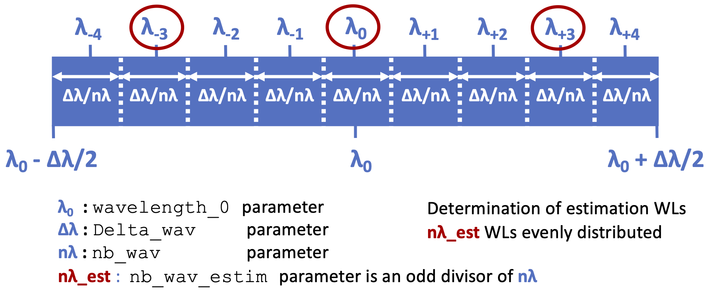

..  _estimation-label:

Estimation
---------------

This section describes how to estimate the electrical field in focal plane in Asterix. Several estimation mode 
are possible in Asterix. Additional details can be found directly in :ref:`the code documentation <estimationfiles-label>`.

It contains 3 functions at least:

- an initialization ``Estimator.__init__()`` The initialization will require previous initialization of the testbed (see previous section) and the [Estimationconfig] part of the parameter file.  
It set up everything you need for the estimation (e.g. the probes voltages and the PWP matrix). 

- an probe function ``Estimator.probe()``, with parameters:
        - the entrance EF
        - DM voltages
        - the estimation wavelengths
    It returns the probed images as a list (of length ``nb_wav_estim``) of 3d arrays ([2*nprobes,dimScience,dimScience] if PWP or [1+nprobes,dimScience,dimScience] if BTP).

- an estimation function ``Estimator.estimate()``, with parameters:
    - the probed images
    It returns the estimation as a list (of length ``nb_wav_estim``) of 2D arrays. The size
    in pixel of the output is set by the ``Estim_bin_factor`` parameter and is 
    ``dimScience`` / ``Estim_bin_factor``.

.. code-block:: python

    from Asterix.wfsc import Estimator 
    # testbed is previously defined

    Estimationconfig = config["Estimationconfig"]

    myestim = Estimator(Estimationconfig, testbed)

    probed_images = myestim.probe(testbed,
                                    voltage_vector=init_voltage,
                                    entrance_EF=input_wavefront,)

    resultatestimation = myestim.estimate(probed_images)

``estimate`` function has been set up with a mode where each optical plane is saved to .fits file for debugging purposes.
To use this option, set up the keyword ``dir_save_all_planes`` to an existing path directory.

Perfect Estimation
+++++++++++++++++++++++

This is a perfect estimation in focal plane of the electrical field in focal plane. In the case of
a perfect estimation, both the probe and estimate function returns the electrical field in focal plane.
You can use this estimation by setting the parameter ``estimation='Perfect'`` before initialization. However, 
this estimation can be also done wihtout initialization or if another estimation have been initialized: 

.. code-block:: python

    from Asterix.wfsc import Estimator

    # testbed is previously defined
    Estimationconfig = config["Estimationconfig"]    
    
    # we initialize in perfect mode
    Estimationconfig.update({'estimation': "Perfect"})
    myestim = Estimator(Estimationconfig, testbed)
    probed_images = myestim.probe(testbed,
                                    voltage_vector=init_voltage,
                                    entrance_EF=input_wavefront,)

    resultatestimation = myestim.estimate(probed_images)
    # this is a perfect FP estimation

    # we re- initialize in pair-wise mode
    Estimationconfig.update({'estimation': "pw"})
    myestim = Estimator(Estimationconfig, testbed)

    probed_images = myestim.probe(testbed,
                                    voltage_vector=init_voltage,
                                    entrance_EF=input_wavefront)

    resultatestimation = myestim.estimate(probed_images)
    # this is a pair-wise FP estimation

    probed_images = myestim.probe(testbed,
                                    voltage_vector=init_voltage,
                                    entrance_EF=input_wavefront,
                                    perfect_estimation=True)
    resultatestimation = myestim.estimate(voltage_vector=init_voltage,
                                          entrance_EF=input_wavefront,
                                          perfect_estimation=True)
    # this is also a perfect FP estimation, without 
    # re-initializing the estimator

The perfect estimation is exactly equivalent to propagate the light throught the testbed and then
resized by the ``Estim_bin_factor``: 

.. code-block:: python

    from Asterix.utils import resizing
    # testbed is previously defined

    resultatestimation = resizing(testbed.todetector(voltage_vector=init_voltage,
                                  entrance_EF=input_wavefront),myestim.dimEstim) 

All estimators are done this way (first obtains images in the focal plane at the ``Science_sampling`` and 
then resizing) to ensure that the behavior is equivalent to what would be done on a real testbed

Pair Wise Probing (PWP) Estimation
+++++++++++++++++++++++++

The Pair wise probing estimation version we used is defined in 
`Potier et al. (2020) <http://adsabs.harvard.edu/abs/2020A%26A...635A.192P>`_ 
The probe used are actuators, which can be chosen using ``posprobes`` parameter. If you choose 
2 random actuators, it can be useful to check the .fits file starting in *EigenValPW* in 
Interaction_Matrices directory. This is the map of the inverse singular values for each 
pixels and it shows if all of the part of the DH are covered by the estimation (see Fig. 4 in Potier et al. 2020).

Bordé & Traub Probing (BTP) Estimation
+++++++++++++++++++++++++

The Pair wise probing estimation version we used is defined in
`Bordé & Traub (2024) <http://iopscience.iop.org/0004-637X/638/1/488>`_
The difference with Pair Wise Probing is that we do not do a difference between the positive and negative probes but only
a difference between positive probe and the unprobed image. For this estimator, we need a model of the testbed in the estimate function. 

.. code-block:: python

    myestim = Estimator(Estimationconfig, testbed)

    probed_images = myestim.probe(testbed,
                                    voltage_vector=init_voltage,
                                    entrance_EF=input_wavefront)

    resultatestimation = myestim.estimate(probed_images, testbed=testbed)

..  _polychromaticestim-label:
Polychromatic Estimation
++++++++++++++++++++++++++++++

We recall that polychromatic images are parametrized in [modelconfig]. We use ``nb_wav`` simulation wavelengths in ``Delta_wav``, centered on ``wavelength_0`` and then use the `Riemann sum <https://en.wikipedia.org/wiki/Riemann_sum>`_ to approximate the polychromatic image.
If ``mandatory_wls`` is an empty list (``mandatory_wls = ,``), these simulation wavelengths are evenly spaced.
Polychromatic estimation and correction are linked so they are 
both driven by the parameter  the ``[Estimationconfig]`` section, ``polychromatic``:

- ``'singlewl'``: only one wavelength is used for estimation / correction. Probes and PWP / EFC matrices are measured at this wavelength. This parameter allows you to test the results of a monochromatic correction, applied to polychromatic light. 
- ``'broadband_pwprobes'``: This is mostly like the previous case, but probes images used for PWP are broadband (of bandwidth ``Delta_wav``). Matrices are at central wavelength. This is what is currently done in `Potier et al. (2022) <https://ui.adsabs.harvard.edu/abs/2022A%26A...665A.136P/abstract>`_ on SPHERE on sky for example. This mode is only relevant for PWP/BTP estimation and will raise an error if use with perfect estimation.
- ``'multiwl'``: several images at different wls are used for estimation and there are several matrices of estimation. This parameter is only for the estimation / correction. The bandwidth of the images are still parametrized in [modelconfig](nb_wav, Delta_wav)

We have 2 ways of defining the estimation / correction wavelengths. If ``polychromatic = 'broadband_pwprobes'``, the central wavelength and bandwidth are always used. For other case, you can use 2 different methods :

*Method 1 (preferable for beginners):* automatic selection.
If no estimation_wls are hand-picked ``estimation_wls = ,`` the estimation / correction wavelengths are automatically estimated. 

If ``polychromatic = 'singlewl'`` the central wavelength is used.
If ``polychromatic = 'multiwl'`` the wavelengths are automatically selected to be equally distributed in the bandwidth ``[modelconfig](Delta_wav)`` parameter.
We use ``nb_wav_estim`` estimation / correction wavelengths evenly spaced in ``Delta_wav``, centered on 
``wavelength_0``, the same way that the ``nb_wav`` simulation wavelengths are defined. These wavelength must be sub 
parts of the simulated wavelengths because a lot of wavelength specific tools are defined during ``OpticalSystem`` initialization. 
For this reason ``nb_wav_estim`` must be an odd integer, divisor of ``nb_wav``. The next figure shows ``nb_wav = 9`` for the wavelength 
of simulation in blue and ``nb_wav_estim = 3`` for the wavelengths of estimation / correction in red.

    Determination of estimation wavelengths ``estimation.wav_vec_estim``

*Method 2:* hand-pick selection. If ``estimation_wls`` parameter is not an empty list, this
parameter is used to individually hand pick the estimation / correction wavelengths. In this case, these wavelengths must also be added to the list of simulation wavelengths
(parameter ``modelconfig['mandatory_wls']``). If ``polychromatic = 'singlewl'``, ``estimation_wls`` must be a unique element. 

If monochromatic images (``nb_wav = 1`` or ``Delta_wav = 0``), all ``polychromatic`` options are ignored.

COFFEE Estimation
+++++++++++++++++++++++
Currenlty not available

SCC Estimation
+++++++++++++++++++++++
Currenlty not available